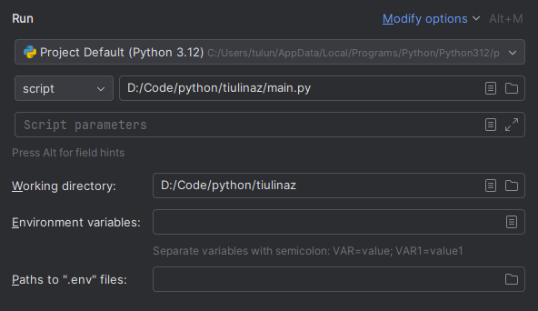

# CryptoBot

CryptoBot is a Python-based cryptocurrency bot that interacts with the Binance.

## Features

- **Account Balance**: Retrieve and display the balance of your Binance account.
- **Top 50 Cryptocurrencies**: List the top 50 cryptocurrencies by market capitalization on Binance.
- **Favorite Cryptocurrencies**: Create, add to, and manage a list of your favorite cryptocurrencies.

## Dependencies

The bot requires the following Python packages:

- `requests`
- `python-binance`
- `aiogram`
- `pytest`

You can install these dependencies using pip:

```bash
pip install -r requirements.txt
```

## Installation for personal usage
1.Clone the repository:
```bash
git clone https://gitlab.fit.cvut.cz/BI-PYT/B232/tiulinaz
cd tiulinaz
```
2.Create a file called .env and add the contents below to it
```bash
BINANCE_API_KEY=your_api_key_here
BINANCE_API_SECRET=your_api_secret_here
BOT_TOKEN=your_bot_token
```
3.Add the .env file to the configuration of the main.py file


## Usage
Or you can use the bot at this link:
`@tiulinaz_bot`

## Running Tests
To run the tests from the CLI, use the following command:
```bash
pytest tests/test.py
```
Make sure you have pytest installed:
```bash
pip install pytest
```